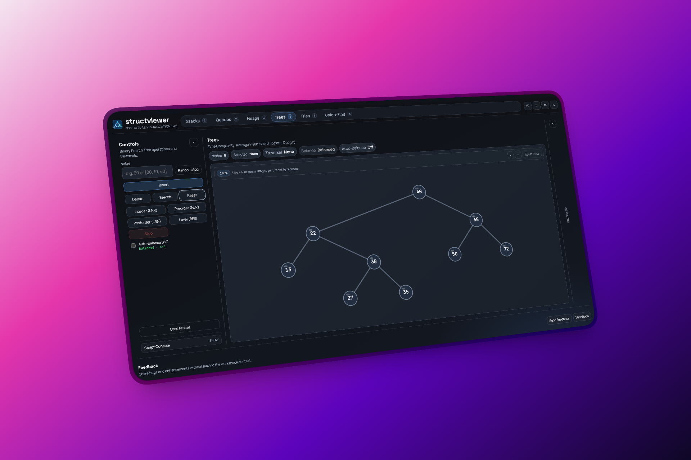

# StructViewer

**See data structures move, not just compile.**

[](https://app.netlify.com/projects/structviewer/deploys)
[](https://react.dev/)
[](https://www.typescriptlang.org/)
[](https://vitejs.dev/)
[](https://www.framer.com/motion/)
[](https://zustand-demo.pmnd.rs/)
[](https://vitest.dev/)

StructViewer turns core DSA operations into an interactive visual experience with smooth transitions, timeline playback, and instant operational feedback.

[Live Demo](https://structviewer.online/) · [Report Feedback](https://structviewer.online/)



## Why StructViewer

Most learning tools show the final answer.
StructViewer shows the journey:

- Every operation creates a timeline step
- Every step is replayable
- Every state change is visible
- Every action includes complexity context

## Explore 6 Core Modules

- **Stacks**: Push, pop, peek, clear, presets
- **Queues**: Enqueue, dequeue, front, clear, presets
- **Heaps**: Min/max modes, insert, extract root, reset, presets
- **Binary Search Trees**: Insert, delete, search, traversals, auto-balance toggle
- **Tries**: Insert/delete/search words, prefix queries
- **Union-Find**: Resize, union, find, connected checks

## What Makes It Different

- **Timeline-first UX** for replaying every operation
- **Fluid animations** for insertion, reordering, and traversal states
- **Script Console** to execute multi-step command flows quickly
- **Keyboard-first controls** with command palette + shortcuts
- **Responsive workspace** that keeps controls, visualization, and inspector in sync

## Built For

- Students preparing for interviews and exams
- Educators running live DSA demos
- Developers who want fast visual intuition for algorithm behavior

## At a Glance

- Frontend: React + TypeScript + Vite
- Motion: Framer Motion
- State: Zustand
- Testing: Vitest

## Minimal Local Run

```bash
npm install
npm run dev
```

## Docs

- Product idea: `docs/idea/product-idea.md`
- UI/UX direction: `docs/design/ui-ux-design.md`
- Architecture notes: `docs/architecture/file-tree.md`
